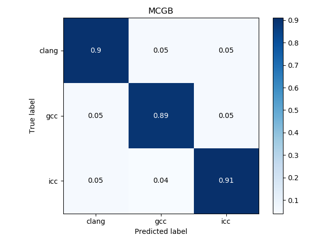
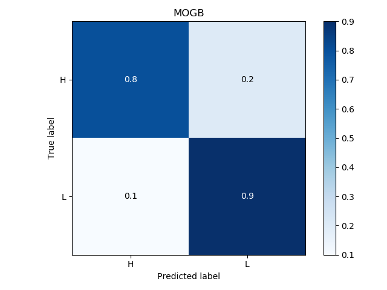
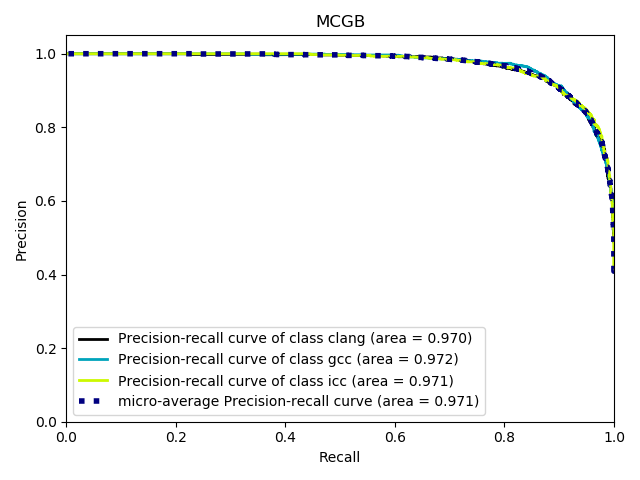
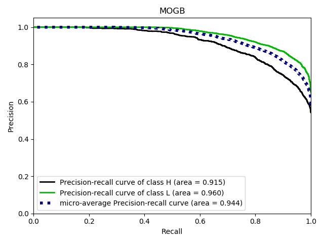

# Machine Learning: Compiler Provenance
One of the most common problems in binary analysis is to find compiler provenance. In particular, the aim of this homework is to identify optimization level and compiler which produced a given program. The importance of predicting the compiler is given mainly by aspects related to cybersecurity. In detail, it can provides a more accurate disassembly of a malware.

See [Report](report.pdf).

*"La Sapienza" University of Rome - MSc in Artificial Intelligence and Robotics*, Machine Learning 2019/2020
\
\
  

  
